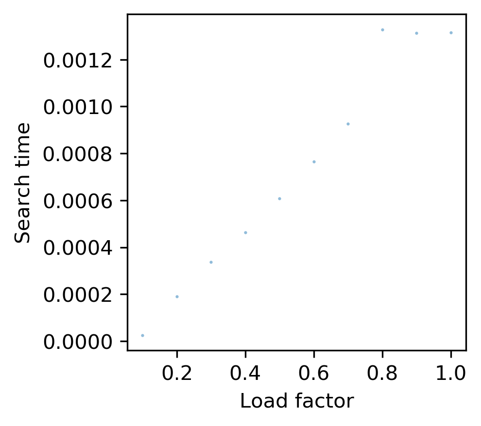

# Hash tables
A demonstration of hash tables

## Description
This repository containes code for custom hash tables and hash functions. This demonstrates different ways that you can hash strings and different ways to handle collision resolution.

Specifically, the repository contains to main modules. The first is called `hash_functions` and not suprisingly contains the two different hash functions available: one though simple ASCII summing, and the second with a rolling polynomial sumation. The second module is called `hash_tables`. This module contains two different types of hash table classes: one that uses linear probing, and the other that uses chained hashing.

## How to use
The project is meant to be used by accessing it through the `hash_tables` module and referencing the functions within the `hash_functions` module. The module can simply be imported into a Python script by the below command:

```
import hash_tables
from hash_functions import h_ascii
from hash_functions import h_rolling
```

From there, you can then add key/value pairs and search for values based on the given key by using the built in `add` and `search` functions built in to each table class. An example of this follows:

```
import hash_tables
from hash_functions import h_ascii

table = LinearProbe(100, h_ascii)
table.add("key1", "value1")
table.search("key1")
```

## Benchmarking
This project also has some built in benchmarking. You can run the provided script `benchmarking.sh` to see generate the provided `.png` files that show the pros and cons of the different hashing techniques. Simply run the command below:

```
bash benchmarking.sh
```

As a small discussion of these benchmarking results. We will show the generated images and reflect on them.

Rolling Non-random         |  ASCII Non-random
:-------------------------:|:-------------------------:
  |  

Comparing the two above images we see that for the case of non-randomized input strings, the ASCII summation technique is not nearly as effective as the ASCII rolling hashing function. This is because it clumps similar words together and thus does a poor job of using the full extent of the hash table space.

Rolling Random         |  ASCII Random
:-------------------------:|:-------------------------:
  |  

In the case of a random set of input strings, the comparison is much closer. However, we still see that the rolling function does a better job of using all of the space available in the hash table while the ASCII summation tends to clump the strings in rows.

Rolling Search Time         |  ASCII Search Time
:-------------------------:|:-------------------------:
  |  

Comparing search time, we see that the ASCII summation does a better job of keeping the search time linearly dependent on load factor. For the rolling hash function we see erratic behavior, but over all the times are an order of magnitude smaller so the rolling hash function still shows better performance.

## Installation
First, this project requires cloning the repository and making sure that you have Python 3 installed with `matplotlib` and `numpy`. Assuming Python 3 is already installed, you can run the below command to install the required package:

```
pip install matplotlib
pip install numpy
```
